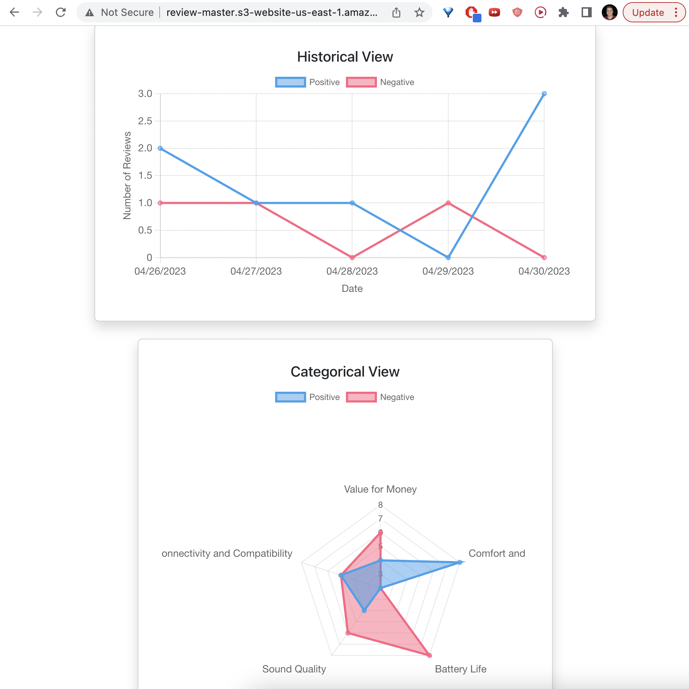

# Review Master

[](https://github.com/boraelci/review-master/actions?query=workflow%3A%22Build+Status%22)
[](https://codecov.io/gh/boraelci/review-master)
[](https://www.npmjs.com/package/review-master)
[](https://standardjs.com)
[](https://github.com/boraelci/review-master/blob/main/LICENSE)
[](https://github.com/boraelci/review-master/issues)
[](https://boraelci.github.io/review-master/)

## Overview

Review Insights is a powerful library designed to help businesses visualize and understand customer sentiment from product reviews. With the increasing number of reviews left by customers on e-commerce platforms, it becomes a daunting task for sellers to manually read and analyze them all. This library simplifies this process by presenting the insights derived from sentiment analysis in a visually appealing and easily digestible manner.

Imagine a pair of headphones listed on an e-commerce website with thousands of customer reviews. By using sentiment analysis, we can determine what percentage of customers think the product is cheap or expensive and high-quality or low-quality, among other aspects. This library takes these results and presents them in an interactive and engaging way, allowing sellers to make informed decisions based on the overall customer sentiment.

Key features include:

- **Historical View**: Track and visualize the changes in customer sentiment over time, enabling you to see how product improvements, price changes, or marketing campaigns have influenced customer perception.

- **Categorical View**: Dive deeper into specific aspects of the product, such as price, quality, or durability, and see how customers feel about each of them.

- **Statistical Analysis of Star Ratings**: Get a comprehensive statistical analysis of the star ratings customers give to your products. This includes mean, median, standard deviation, and quartiles, helping you to better understand the distribution and trends of customer satisfaction.

## Example

Check out the example React application at http://review-master.s3-website-us-east-1.amazonaws.com/

[](http://review-master.s3-website-us-east-1.amazonaws.com)

## Documentation

Explore the docs at https://boraelci.github.io/review-master/

## Install

To get started with the `review-master`, install it as a dependency in your project:

```bash
npm install --save review-master
```

Make sure you have the required peer dependencies installed as well:

```bash
npm install react react-dom chart.js react-chartjs-2 bootstrap react-bootstrap
```

## Usage

Below is an example with built-in, sample DataProviders. To display custom values, Create your own DataProvider by implementing that interface, with getData() and getLabels() methods.

```tsx
import { Chart as ChartJS, registerables } from 'chart.js';
import { Line, Radar } from 'react-chartjs-2';
import {
  AnalysisModel,
  CategoricalViewer,
  HistoricalViewer,
  StarsViewer,
} from 'review-master';
ChartJS.register(...registerables);
import sampleData from './data/analysisResponse.json';

const analysisModel = new AnalysisModel(sampleData);
const historicalViewer = new HistoricalViewer(analysisModel, 'day');
const categoricalViewer = new CategoricalViewer(analysisModel);
const starsViewer = new StarsViewer(analysisModel);

const { options: historicalOptions, data: historicalData } =
  historicalViewer.getOptionsAndData();
const { options: categoricalOptions, data: categoricalData } =
  categoricalViewer.getOptionsAndData();

return <Line options={historicalOptions} data={historicalData} />;
// or <Radar options={categoricalOptions} data={categoricalData} />
// or starsViewer.createTable()
```

## Tests

Unit and integration tests can be found at [`./src/tests`](https://github.com/boraelci/review-master/tree/main/src/tests) since this is the directory convention required by create-react-library with jest. The coverage report can be accessed at `./coverage/lcov-report/index.html`. The latest report indicates:

Test Suites: 6 passed, 6 total
Tests: 27 passed, 27 total
Snapshots: 0 total
Time: 0.857 s, estimated 1 s

## Scripts

This project uses the TypeScript dialect of JavaScript. It has the following commands:

### `npm install`

Install dependencies

### `npm start`

Start in developer mode

### `npm test`

Run the test suite and show coverage information. A report is generated at `./coverage/lcov-report/index.html`

### `npm run lint`

Run static analysis with `eslint`

### `npm run prettier`

Autoformat the code with `prettier`

### `npm run build`

Build the app for production to the `dist` folder.

## Contributing

See [`CONTRIBUTING.md`](https://github.com/boraelci/review-master/blob/main/CONTRIBUTING.md)
